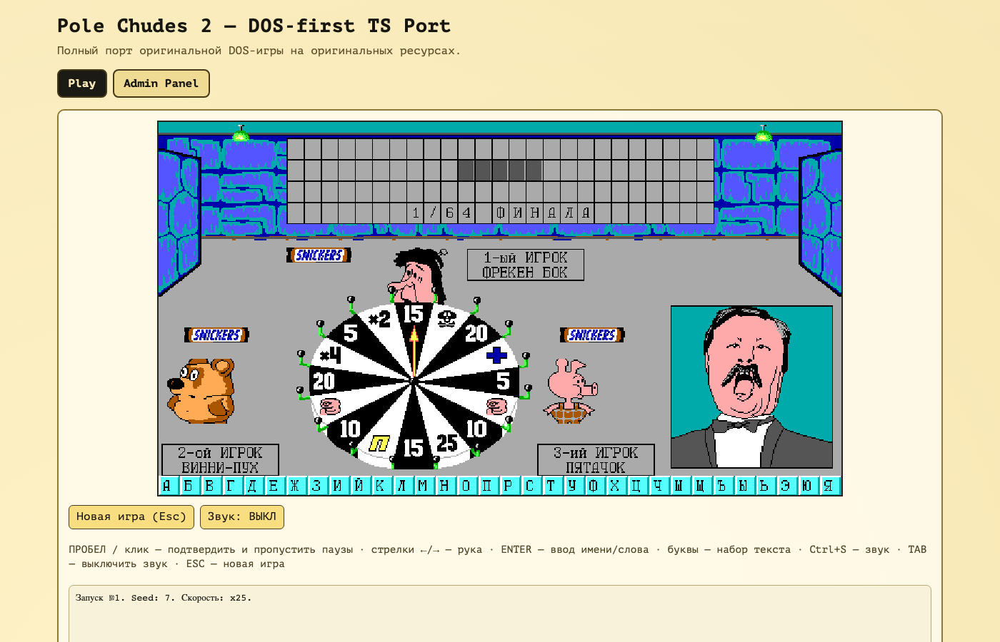
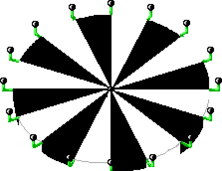

# Поле Чудес 2 — DOS-first TypeScript port

A faithful browser port of **Pole Chudes 2** (Вадим «Дима» Башуров, 1993) — the
classic Russian DOS game show — written in TypeScript. The original source code
is lost; this port reimplements the complete game from its original binary
assets and a public-domain disassembly-based reconstruction, scene for scene:
splash intro, player presentation with name entry, eight tournament stages
(1/64 ФИНАЛА → СУПЕРФИНАЛ), the 16-sector wheel, hand-cursor letter picking,
the assistant flipping letters on the board, the шкатулки minigame, prize
bargaining with Якубович, ad breaks, the endgame ceremony, and the top-8 table.



## Run it

```bash
cd web
npm install
npm run dev        # open the printed URL
```

URL parameters: `?seed=42` reproduces a whole game deterministically,
`?fast=10` scales every delay (useful for testing).

Controls (as in DOS): **Space / click** — confirm and skip pauses,
**←/→** — move the hand, **Enter** — accept name/word entry,
**letters** — type text, **Ctrl+S** — sound on/off (off by default, as in DOS),
**Tab** — boss-key mute, **Alt+Enter** — fullscreen, **Esc** — new game.

The **Admin Panel** tab hosts a session-scoped question editor with
import/export of binary-correct `POLE.OVL` files.

## Verify

```bash
cd web
npm run test     # 93 unit + integration tests, incl. seeded headless full games
npm run build
npm run smoke    # Playwright: splash → name entry → spin → letter → solve
npm run verify   # all of the above
```

## How it works

- `web/src/assets/` — codecs for the original data formats: `POLE2.LIB`
  (row-RLE sprites), `POLE.FNT` (8px bitmap fonts ×3 heights), `POLE.OVL`
  (encoded question dictionary), `POLE.PIC` (top-8 table). The shipped assets
  are editable transcodes of those files — graphics as lossless WebP images
  (one per sprite, plus font glyph atlases, openable in any image editor) with
  slim JSON manifests, question text and scores as JSON — each proven to
  rebuild its original byte-for-byte (sha256-pinned in tests).
- `web/src/engine/` — the "DOS machine": a linear 640×750 indexed framebuffer
  with the original's back-buffer scratch regions, sprite/glyph/fill/copy
  primitives, a 50 fps presenter, Win32-style auto-reset key events, an 8 kHz
  PWM square-wave audio synth, an abortable clock, and the Borland LCG for
  seed-exact randomness.
- `web/src/game/script.ts` — a direct port of the original main loop, with
  `dpr:NNN` comments citing the reference source line by line.
- `web/src/spec/` — machine-readable facts (formats, palette, geometry, sector
  dispatch) plus a parity-case ledger, pinned by tests.

Design and fidelity policy: [`docs/architecture.md`](docs/architecture.md).
Accepted deviations from the DOS original:
[`DIFF_FROM_ORIGINAL.md`](DIFF_FROM_ORIGINAL.md).
Research notes and evidence trail: [`reverse-engineering/`](reverse-engineering/).

## Zero binaries: the whole game is editable source



The original game was five opaque binary files (178,777 bytes). This repo
ships **none of them** — every byte is converted to a source format a human
can open and edit, and every conversion is proven lossless:

- **POLE2.EXE** (56,528 B of 16-bit code) → TypeScript. The executable is not
  shipped or executed; its behavior lives in `web/src/engine/` and
  `web/src/game/script.ts`, cross-referenced line-by-line against the
  public-domain reconstruction.
- **POLE2.LIB** (61 RLE-compressed sprites) → 61 lossless WebP images in
  [`web/public/assets/sprites/`](web/public/assets/sprites/) — the spinning
  wheel on the right is four of them — plus a slim JSON manifest for the
  bytes an image can't carry (sprite order and the original packer's
  stale-buffer padding, preserved verbatim).
- **POLE.FNT** (3 bitmap fonts) → three WebP glyph atlases in
  [`web/public/assets/fonts/`](web/public/assets/fonts/) (16×16 CP866 glyphs
  each, white = bit set).
- **POLE.OVL** (686 encoded questions) and **POLE.PIC** (top-8 table) → plain
  JSON with the question text readable in any editor.

The trick that keeps this honest: the build can run the conversion in
reverse. `web/src/assets/transcoded.test.ts` re-encodes the WebP pixels
through the inferred row-RLE packer and rebuilds each original file
**byte-for-byte** (sha256-pinned; the originals themselves stay in a
gitignored `_local/` directory as test fixtures). Edit a sprite and the game
happily runs your fork — but the fidelity tests will tell you it's no longer
the 1993 original.

## Attribution and asset note

- Behavioral reference: the public-domain (Unlicense) Delphi reconstruction
  [fersatgit/Pole2](https://github.com/fersatgit/Pole2), built by disassembling
  the original `POLE2.exe`. A UTF-8 decoded copy lives in
  [`reference/delphi/`](reference/delphi/) with matching line numbers.
- `web/public/assets/` contains the original 1993 game data
  (`POLE2.LIB`, `POLE.FNT`, `POLE.OVL`, `POLE.PIC`) © Вадим Башуров,
  transcoded to editable sources (lossless WebP images for the graphics, JSON
  for the rest) that rebuild the original binaries byte-for-byte — the
  transcode changes the format, not the provenance. The
  data is included for preservation and is required to run the game; no
  original executable code is shipped or executed. If you are a rights holder
  and want it removed, open an issue.
- The TypeScript code in this repository is original work, released under the
  MIT license ([`LICENSE`](LICENSE)); the license does not extend to the
  transcoded 1993 game data.
